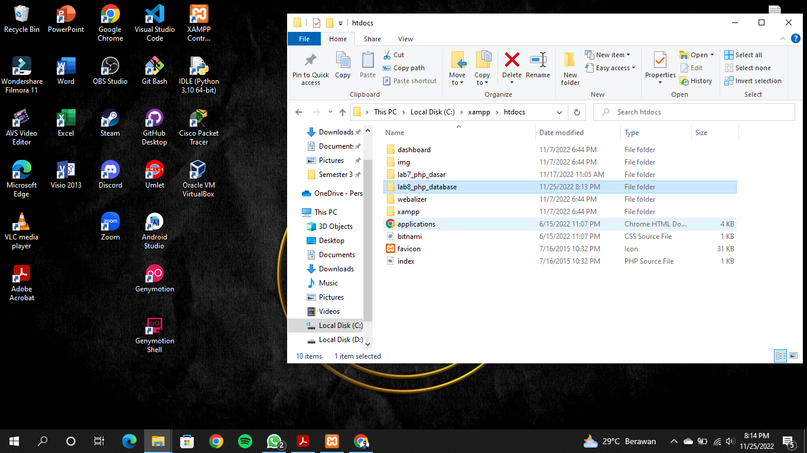
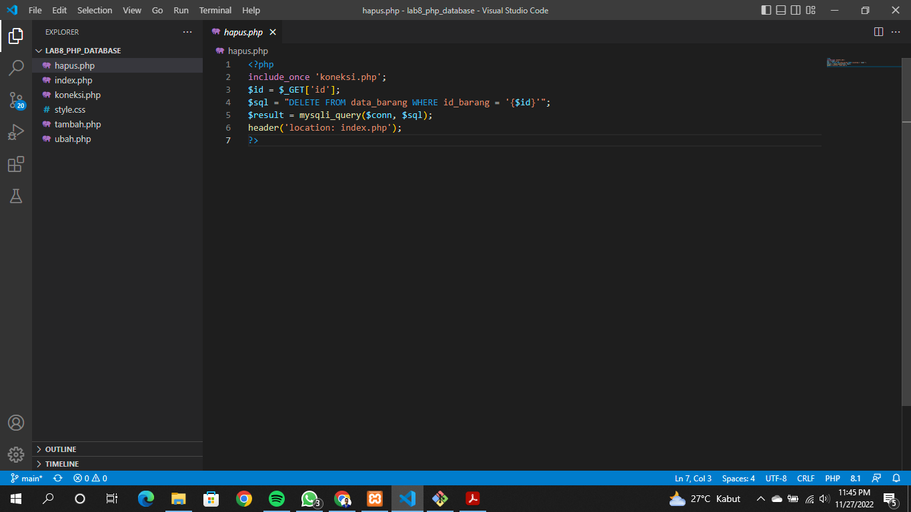

# Lab8Web

## Langkah-langkah Praktikum

### Persiapan
Untuk memulai membuat aplikasi CRUD sederhana, yang perlu disiapkan adalah database server menggunakan MySQL. Pastikan MySQL Server sudah dapat dijalankan melalui XAMPP.

### Menjalankan MySQLServer
Untuk menjalankan MySQL Server dari menu XAMPP Contol.

### Mengakses MySQL Client menggunakan PHP MyAdmin
Pastikan webserver Apache dan MySQL server sudah dijalankan. Kemudian buka melalui browser: http://localhost/phpmyadmin/

### Membuat Database

### Membuat Tabel

### Menambahkan Data

Hasilnya

### Membuat Program CRUD
Buat folder lab8_php_database pada root directory web server (d:\xampp\htdocs)

Kemudian untuk mengakses direktory tersebut pada web server dengan mengakses URL: http://localhost/lab8_php_database/

### Membuat file koneksi database
Buat file baru dengan nama koneksi.php

Buka melalui browser untuk menguji koneksi database (untuk menyampilkan pesan koneksi berhasil, uncomment pada perintah echo “koneksi berhasil”;

### Membuat file index untuk menampilkan data (Read)
Buat file baru dengan nama index.php

Refresh dan hasilnya akan seperti ini

### Menambah Data (Create)
Buat file baru dengan nama tambah.php

Klik Tambah Barang lalu diinput

Maka hasilnya akan seperti ini

### Mengubah Data (Update)
Buat file baru dengan nama ubah.php

Klik Ubah lalu ubah sesuai kebutuhan

Maka hasilnya akan seperti ini

### Menghapus Data (Delete)
Buat file baru dengan nama hapus.php

Inilah file sebelumnya

Klik Hapus data yang paling bawah, maka hasilnya akan seperti ini

